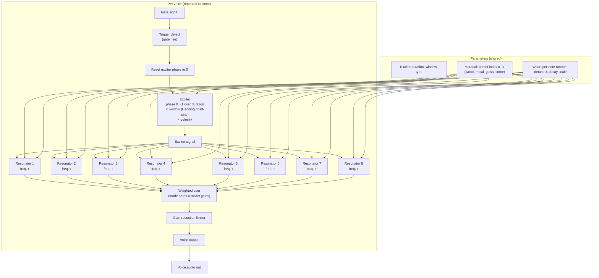

# Modal bar synth (gen~) — struck bar physical model

Real modal synthesis in **gen~**: one voice per instance; use **poly~** for polyphony. Each voice has a **variable-length windowed exciter** (Hanning window) driving **8 parallel two-pole resonators**. **Material** (frequency ratios) selects bar type: wood, metal, glass, stone. **Decay**, **softness** (mallet hardness), and **force** (gain) shape the sound. **Gate/velocity** and **frequency** are the voice inputs.

**Implementation details:** see [MODAL_BAR_GEN_DESIGN.md](MODAL_BAR_GEN_DESIGN.md). Code lives in `src/modal_bar/`.

## Algorithm (process flow)



*(Poly~ sums voice outputs externally.)*

- **Trigger:** Gate rise (e.g. 0→1) resets exciter phase and samples new per-note randomness (detune, decay scale) for that voice.
- **Exciter:** Phase runs 0→1 over a variable duration (shorter for harder mallet). Sample value = window(phase) × velocity; window is Hanning or half-sine.
- **Resonators:** Eight parallel two-pole resonators. Each has centre frequency (base_freq × ratio × detune) and decay time τ (base_decay × mode_scale × velocity × decay_scale). Same exciter drives all eight; each resonates at its mode.
- **Mix & limit:** Mode outputs are summed with fixed weights and mallet-dependent gains, then passed through a gain-reduction limiter. All voice outputs are summed with a master gain to form the final audio out.

### Algorithm pseudocode

```
// --- Per-sample, one voice ---
// Inputs: frequency (Hz), amplitude (0–1), gate, material (int 0–3), size, mallet, wear (0–1)

trigger = (gate > 0.5) AND (previous(gate) <= 0.5)   // rising edge
base_freq = frequency * size
velocity = amplitude

// Derived parameters (no extra inlets)
base_decay_sec = 0.3 + 1.2*size
exciter_dur_sec = 0.005 * (1.5 - 0.5*mallet)
vel_scale = 0.5 + 0.5*velocity

// --- Exciter (variable-length windowed pulse) ---
if trigger then
  exc_phase = 0
else
  exc_phase = min(1, exc_phase + (1/sample_rate) / exciter_dur_sec)
end
if exc_phase < 1 then
  exc_sig = window(exc_phase) * velocity   // window = Hanning or half-sine, 0→1
else
  exc_sig = 0
end

// --- Mode ratios from material preset (int 0–3) ---
// 0=wood, 1=metal, 2=glass, 3=stone (quantize in4: <0.5→0, <1.5→1, <2.5→2, else 3)
for m = 1 to 8:
  ratio[m] = preset_ratio(material_index, m)

// --- Per-mode randomness (updated only on trigger) ---
if trigger then
  for m = 1 to 8:
    detune[m] = 1 + wear * uniform(-0.015, 0.015)
    decay_scale[m] = 1 + wear * uniform(-0.25, 0.25)
else
  detune[m], decay_scale[m] = previous values
end

// --- Eight parallel two-pole resonators ---
for m = 1 to 8:
  tau[m] = base_decay_sec * decay_scale_per_mode[m] * vel_scale * decay_scale[m]
  freq[m] = base_freq * ratio[m] * detune[m]
  // 2-pole resonator: y[n] = b0*exc + a1*y[n-1] + a2*y[n-2]
  // r = exp(-dt/tau), w = 2π*freq*dt, a1 = 2r·cos(w), a2 = -r², b0 = 1-r²
  y[m] = resonator_step(exc_sig, tau[m], freq[m], y[m]_prev_1, y[m]_prev_2)
end

// --- Mix and limit ---
mallet_gain[1] = 1
for m = 2 to 8: mallet_gain[m] = lerp(lo[m], 1, mallet)   // higher modes boosted by mallet
mix = Σ (mode_amp[m] * mallet_gain[m] * y[m]) for m = 1..8
out = soft_limit(mix, threshold=1)
```

- **Trigger:** One-sample "bang" on gate rise; resets exciter phase and draws new per-note detune/decay_scale.
- **Resonator:** Standard 2-pole (biquad) with pole radius r = exp(-dt/τ), angle ω = 2π·f·dt.
- **Material:** `ratio_for_mode(material, m)` blends two fixed ratio tables (bright bar vs darker bar).

---

## gen~ code (source files)

- **Location:** `src/modal_bar/` — modal bar codebox and gen~ patcher.
- **Main files:**
  - `modal_bar.codebox` — Combined exciter + single resonator (one mode)
  - `modal_bar.gendsp` — Complete 8-mode bar gen~ patcher
- **Workflow:** Use the `.gendsp` file directly, or create custom patchers using 8 instances of the codebox.

### modal_bar.codebox — Inlets

1. `gate` — Trigger/velocity (0 or 0.01-1.0)
2. `base_freq` — Fundamental frequency (Hz)
3. `ratio` — Frequency multiplier for this mode
4. `decay` — Tau, decay time in seconds (0.1-5.0)
5. `softness` — Mallet hardness, 0=hard, 1=soft (0.0-1.0)
6. `force` — Output gain (0.0-1.0)
7. `sr_hz` — Sample rate (Hz)

### Material presets (filter frequency ratios, fundamental = 1)

| Material | Mode ratios (1–8) |
|----------|-------------------|
| Wood (uniform wooden bar) | 1.0, 2.572, 4.644, 6.984, 9.723, 12.0, 14.756, 17.687 |
| Metal (aluminum bar) | 1.0, 2.756, 5.423, 8.988, 13.448, 18.68, 24.566, 31.147 |
| Glass (wine glass) | 1.0, 2.32, 4.25, 6.63, 9.38, 12.5, 16.0, 19.9 |
| Stone (Tibetan bowl) | 1.0, 2.778, 5.181, 8.163, 11.661, 15.638, 19.99, 24.65 |

### Parameters

- **decay:** Resonator decay time (tau) in seconds (0.1 = dry, 1.0 = natural, 5.0 = long ringing)
- **softness:** Mallet softness, 0=hard wood (1ms, bright), 1=soft felt (10ms, warm)
- **force:** Output gain before soft limiting (0.0 to 1.0)
- **gate/velocity:** Trigger amplitude controls strike force (0.01 = soft, 1.0 = hard)

---

## Max wrapper (high level)

### Basic usage (single voice)

```
[mtof] ← MIDI note          [toggle] ← gate
   |                             |
[sig~]                        [sig~]
   |                             |
   └────→ [gen~ modal_bar] ←────┘
              ↑  ↑  ↑
              |  |  └─ [prepend force] ← [0.0-1.0]
              |  └──── [prepend softness] ← [0.0-1.0]
              └─────── [prepend decay] ← [0.1-5.0]
              |
           [dac~]
```

### Polyphony with poly~

- Put `[gen~ modal_bar]` inside a `[poly~]`
- Voice allocation: note-on → assign free voice, note-off → release
- Shared params (decay, softness, force) via poly~ param messages
- poly~ **out** → master gain → **plugout~**

---

## Notes

- **Sample rate:** Pass samplerate into the gen~ (e.g. inlet or **samplerate** object) for correct timing at 44.1 / 48 kHz.
- To view or edit the Mermaid diagram, paste it into [mermaid.live](https://mermaid.live).
