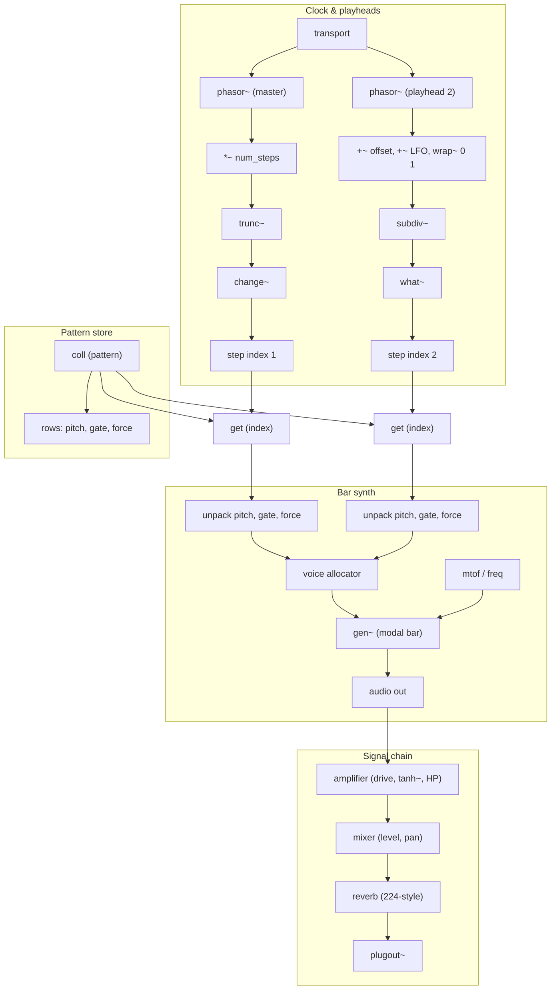

# Drifter — high-level patch architecture

Block diagram of the Max for Live device: clock, playheads, pattern store, bar synth, and signal chain. For object-level detail see [.cursor/rules/planedrifter-max.mdc](../.cursor/rules/planedrifter-max.mdc) and [PROJECT_BRIEF.md](../PROJECT_BRIEF.md).

---

## Mermaid diagram

---

## Legend

| Block | Role |
|--------|------|
| **transport** | DAW sync; drives phasor~ @lock 1. |
| **phasor~ (master)** | Master clock (e.g. 1n). × num_steps → step index for playhead 1. |
| **phasor~ (playhead 2)** | Second playhead; optional phase offset + LFO → wrap~ → subdiv~. Variable rate, reset. |
| **subdiv~** | Subdivides phasor into steps; outputs subdivided phase + step index. |
| **what~** | Sample-accurate step index from subdiv~ index (trigger on step change). |
| **coll (pattern)** | One pattern: rows = steps; columns = pitch, gate, force. Length = num_steps (variable). |
| **get / unpack** | Playheads read step index → get row → unpack (pitch, gate, force). |
| **voice allocator** | Maps note-ons to 8 voices; pitch → freq, gate → trigger, force → velocity. |
| **gen~ (modal bar)** | Exciter + 8-filter bank; material, size, wear, mallet. See [MODAL_BAR_README.md](MODAL_BAR_README.md) and [MODAL_BAR_GEN_DESIGN.md](MODAL_BAR_GEN_DESIGN.md). |
| **amplifier** | Contact-mic / tube preamp character: drive, tanh~, high-pass, tone. |
| **mixer** | Level and constant-power pan per channel; optional send to reverb. |
| **reverb** | Lexicon 224–style (allpass, modulated delays, long tail). |
| **plugout~** | Device audio output. |

---

To view or edit the diagram, paste the Mermaid code block into [mermaid.live](https://mermaid.live).
